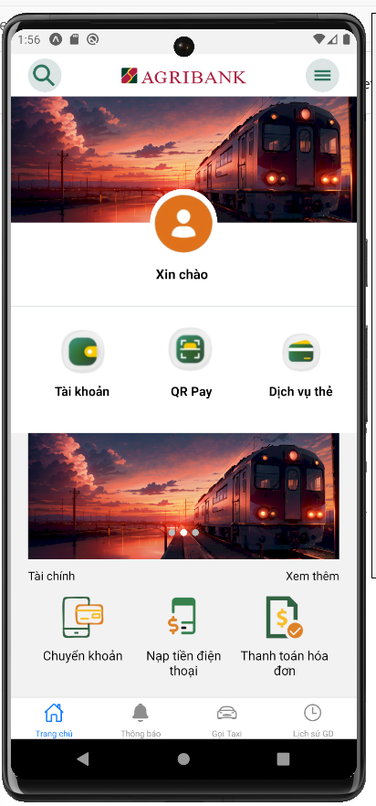

# Ứng dụng Ngân hàng XYZ

## Giới thiệu

Chào mừng bạn đến với Ứng dụng Ngân hàng XYZ, một giải pháp toàn diện cho tất cả các nhu cầu tài chính của bạn. Với ứng dụng này, bạn có thể dễ dàng quản lý tài khoản, chuyển tiền, thanh toán hóa đơn và nhiều tính năng khác ngay trên điện thoại di động của mình.

## Tính năng

- **Quản lý tài khoản:** Xem số dư tài khoản, lịch sử giao dịch và chi tiết tài khoản của bạn.

- **Chuyển tiền:** Thực hiện các giao dịch chuyển tiền nội bộ và liên ngân hàng một cách nhanh chóng và an toàn.
- **Thanh toán hóa đơn:** Thanh toán các hóa đơn điện, nước, internet, và nhiều loại hóa đơn khác chỉ với vài thao tác.
- **Tiết kiệm trực tuyến:** Mở và quản lý các tài khoản tiết kiệm trực tuyến với lãi suất hấp dẫn.
- **Thông báo giao dịch:** Nhận thông báo ngay lập tức cho mọi giao dịch thực hiện từ tài khoản của bạn.
- **Bảo mật cao:** Sử dụng công nghệ mã hóa tiên tiến và xác thực hai yếu tố để bảo vệ tài khoản của bạn.

## Yêu cầu hệ thống

- **Hệ điều hành:** iOS 12.0 trở lên hoặc Android 5.0 trở lên
- **Kết nối internet:** Wi-Fi hoặc kết nối dữ liệu di động ổn định

## Cài đặt

### iOS

1. Mở App Store trên thiết bị của bạn.
2. Tìm kiếm "Ngân hàng XYZ".
3. Nhấn vào biểu tượng ứng dụng và sau đó nhấn "Tải xuống" để cài đặt.

### Android

1. Mở Google Play Store trên thiết bị của bạn.
2. Tìm kiếm "Ngân hàng XYZ".
3. Nhấn vào biểu tượng ứng dụng và sau đó nhấn "Cài đặt".

## Hướng dẫn sử dụng

1. **Đăng ký/Đăng nhập:**
   - Mở ứng dụng và chọn "Đăng ký" để tạo tài khoản mới hoặc "Đăng nhập" nếu bạn đã có tài khoản.
   - Nhập thông tin cần thiết và làm theo hướng dẫn để hoàn tất quy trình đăng ký hoặc đăng nhập.

2. **Quản lý tài khoản:**
   - Sau khi đăng nhập, bạn có thể xem thông tin tài khoản, số dư, và lịch sử giao dịch từ trang chủ.

3. **Chuyển tiền:**
   - Chọn mục "Chuyển tiền" từ menu chính.
   - Nhập thông tin người nhận và số tiền cần chuyển, sau đó xác nhận giao dịch.

4. **Thanh toán hóa đơn:**
   - Chọn mục "Thanh toán hóa đơn".
   - Chọn loại hóa đơn cần thanh toán và nhập thông tin cần thiết.

5. **Mở tài khoản tiết kiệm:**
   - Chọn mục "Tiết kiệm trực tuyến".
   - Làm theo hướng dẫn để mở và quản lý tài khoản tiết kiệm.

## Hỗ trợ

Nếu bạn cần hỗ trợ, vui lòng liên hệ với chúng tôi qua:
- **Email:** support@xyzbank.com
- **Số điện thoại:** 1800-123-456

Hoặc truy cập [trang hỗ trợ](https://www.xyzbank.com/support) của chúng tôi để biết thêm chi tiết.

## Đóng góp và Phát triển

Chúng tôi luôn hoan nghênh sự đóng góp từ cộng đồng. Nếu bạn quan tâm đến việc phát triển ứng dụng hoặc có ý kiến đóng góp, vui lòng truy cập [trang GitHub của chúng tôi](https://github.com/xyzbank/app) để biết thêm chi tiết.

---

Cảm ơn bạn đã sử dụng Ứng dụng Ngân hàng XYZ!
